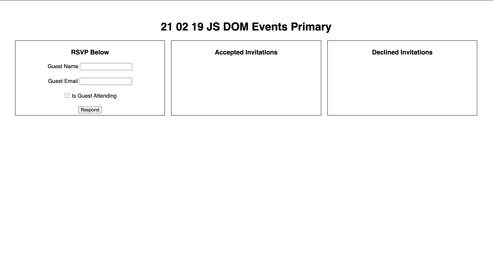
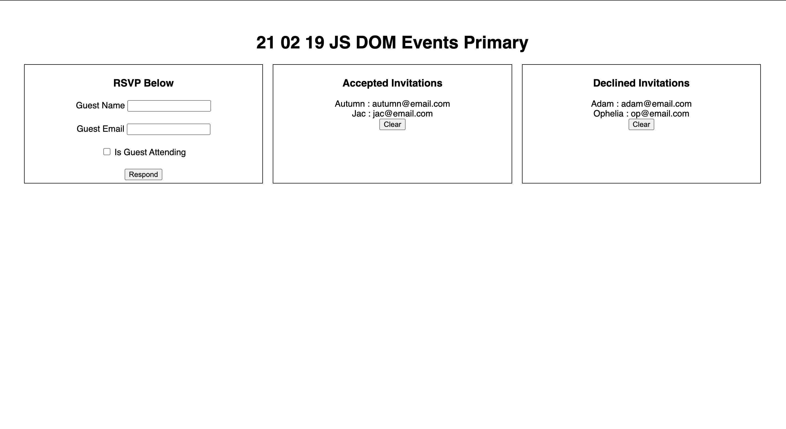

# 21 01 19 JS DOM Events Primary

## Set Up
Add comments throughout the JavaScript file (at minimum). Comment out any broken code before 9PM submission and provide context on what's not working. Link your stylesheet in the head using the link tag. Link the JS file at hte bottom of the body tag using the script tag. Ensure that the files are linked and push before starting on any requirements.

## Requirements
Recreate the wireframe below. Display the assignment title centered at the top of the page. To the left, display a form with name and email fields, both of type text, as well as a checkbox to determine if a guest will be attending or not. Display all form submission for guests attending in the middle and all form submission for guests who decline to the right. A button to clear form submission from an element should be shown in the each of the elements displaying form submission only if there are submission listed(manipulate the clear buttons' visibility only after all other requirements are met). Use grid display and grid template columns to achieve the layout in the wireframe.

You will need to select all three form input fields, the form submit button, the element displaying accepted invitations, the element displaying declined invitations and each button to clear submissions in your JavaScript file. 

When the form submit button is clicked a function to handle the submission should be called that does the following
- Stop the page from reloading
- Append the values from the name and email form fields to the appropriate element mimicking the wireframe
    - if a guest checks the is attending box their information should be added to the list of accepted invitations
    - if a guest does not check the is attending box their information should be added to the list of declined invitations
    - hint : use the `checked` property of the form field to determine if it has been checked or not
- Clear the values from both form fields

When the button to clear accepted invitations is clicked a function to handle clearing accepted submissions should be called to clear all accepted submission from the appropriate element.

When the button to clear declined invitations is clicked a function to handle clearing declined submissions should be called to clear all declined submission from the appropriate element.
